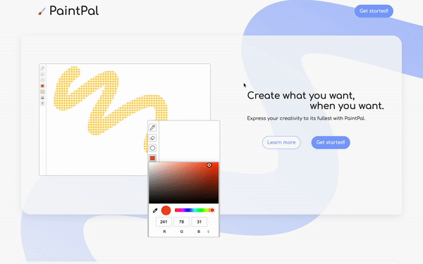
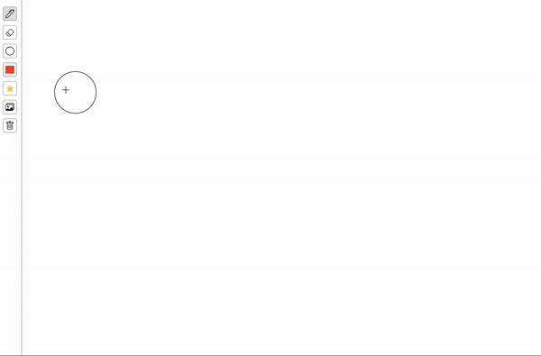

## [PaintPal](https://paintpal.netlify.app/)

### Overview

Paintpal is a front-end painting web app. Users can drag their mouse across the canvas to draw free-form lines and express their creativity through a variety of brush sizes, brush colors, and coloring pages. This project is a submission toward the "Paint App - Becoming Bob Ross" Hackathon hosted by Mintbean.io.

#### View Live Site

<<<<<<< HEAD
Live site URL: [[paintpal.netlify.app]](https://paintpal.netlify.app/)
=======
Live site URL: [[PaintPal]](https://paintpal.netlify.app/)
>>>>>>> a66ac9d13ea3589eadf3a60105e105d4347258cc

### Screenshots

### Built with

- Semantic HTML
- SCSS
- Javascript

## Set-up

<<<<<<< HEAD
1. Clone this repository to your desktop. [https://github.com/carolyndev/paintpal](https://github.com/carolyndev/paintpal)
=======
1. Clone this repository to your desktop. [https://github.com/the-cl/paintpal](https://github.com/the-cl/paintpal)
>>>>>>> a66ac9d13ea3589eadf3a60105e105d4347258cc
2. Navigate to the top level of the directory.
3. Open the index.html file in your web browser.

### Designed and built by Carolyn Lau

<<<<<<< HEAD
- [GitHub](https://github.com/carolyndev)
=======
- [Github](https://github.com/the-cl)
>>>>>>> a66ac9d13ea3589eadf3a60105e105d4347258cc
- [LinkedIn](https://www.linkedin.com/in/carolynlau-profile/)
- [Portfolio](https://carolyndev.com/)
